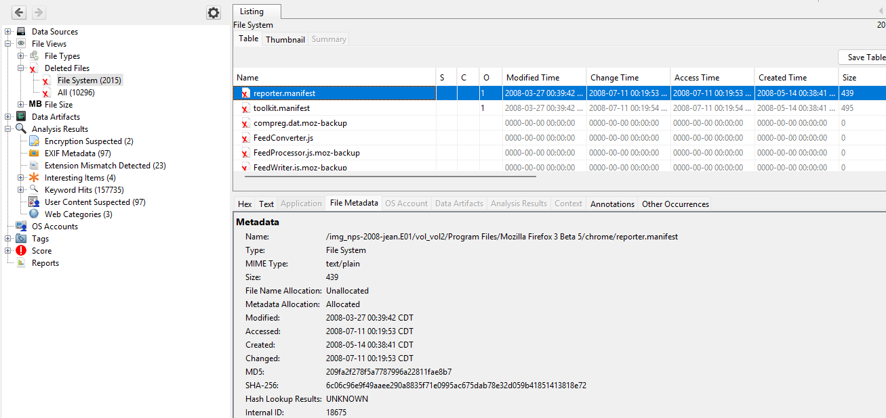
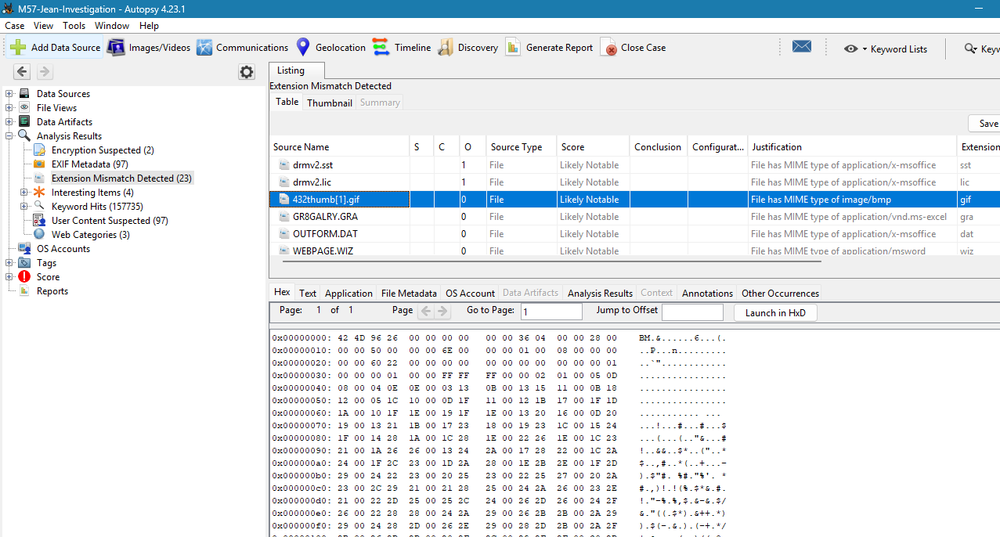
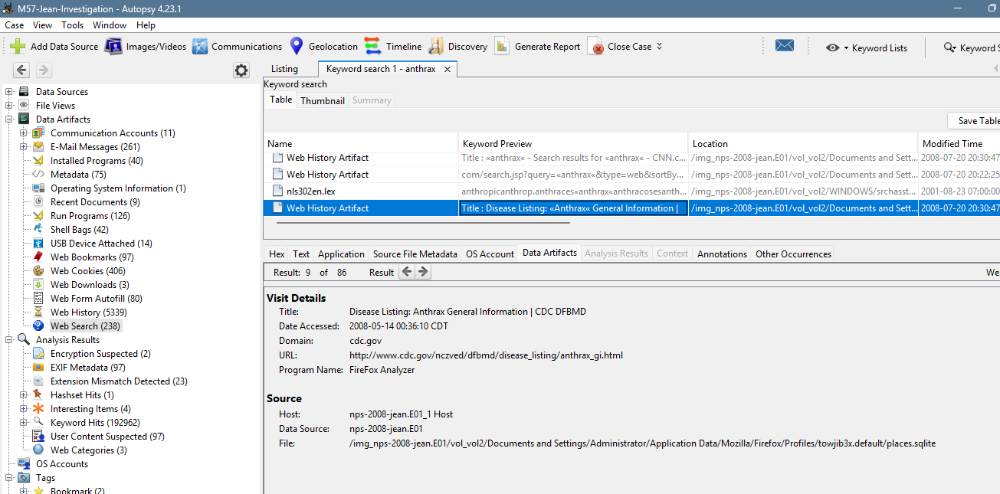
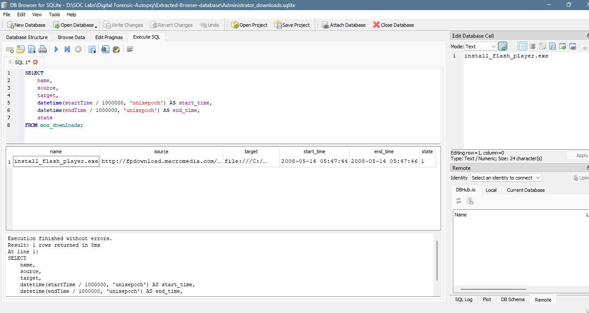
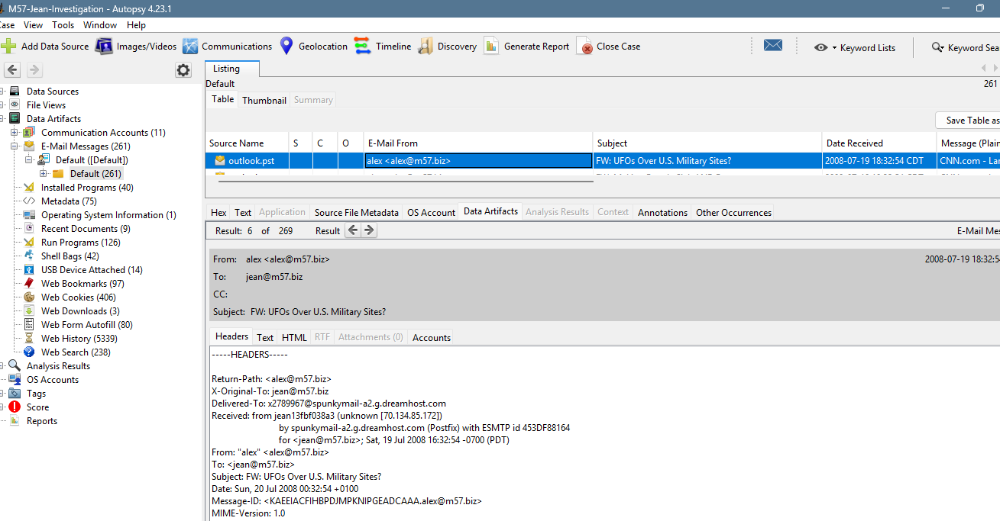
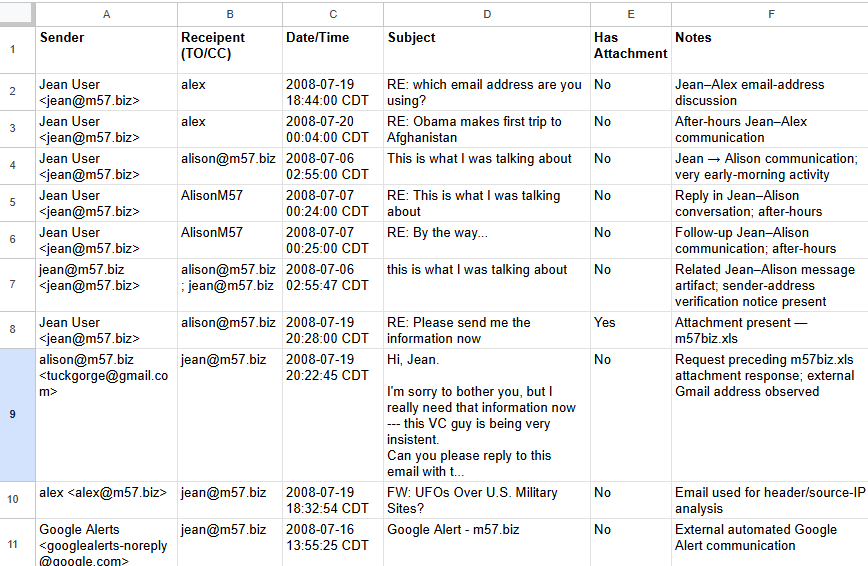
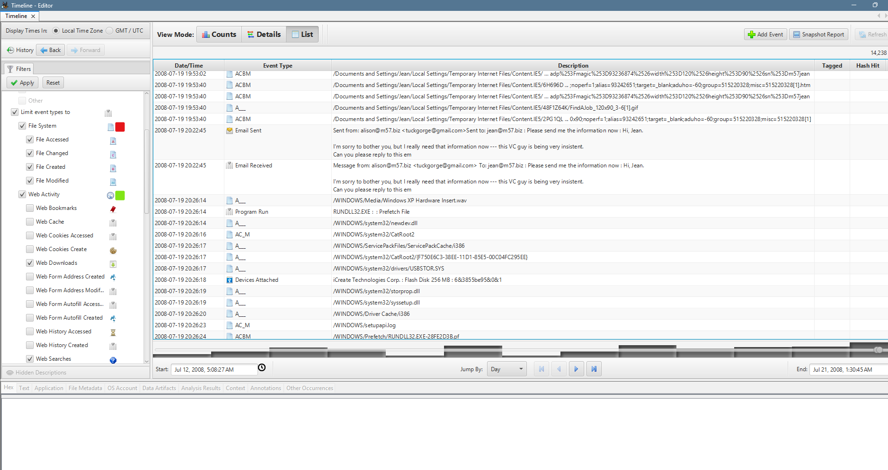
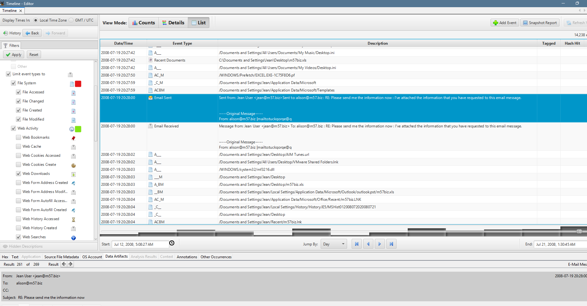

# 🔎 M57-Jean Digital Forensics Investigation

## Overview

This project documents my hands-on digital forensics investigation of the **M57-Jean forensic training image** using **Autopsy 4.23.1**.

The objective was to practice an end-to-end forensic investigation workflow rather than simply locate individual artifacts. I examined file-system activity, deleted data, browser artifacts, email communications, attachments, keyword results, and timeline events, then correlated relevant evidence to reconstruct user activity.

This project was completed as part of my practical learning toward **SOC Analyst L1 and Digital Forensics roles**.

---

## 🛠️ Tools & Technologies

- Autopsy 4.23.1
- The Sleuth Kit (TSK)
- M57-Jean forensic training image (`.E01`)
- NTFS file-system analysis
- Keyword and regex searching
- Hash analysis concepts
- Browser artifact analysis
- Email / PST analysis
- Timeline analysis

---

## 🔬 Investigation Workflow

The investigation followed a structured forensic process:

1. Created the forensic case and added the `.E01` evidence image
2. Configured and ran Autopsy ingest modules
3. Examined NTFS file-system artifacts and metadata
4. Investigated deleted files and recoverable content
5. Performed targeted keyword and regex searches
6. Reviewed browser history, searches, downloads, and related web artifacts
7. Analyzed Outlook/PST email communications and attachments
8. Built a communication matrix for selected messages
9. Used Autopsy Timeline to correlate activity chronologically
10. Documented findings, supporting evidence, and investigation limitations

---

## 📂 Analysis Areas

### 1. File-System Analysis

Reviewed NTFS artifacts including:

- File metadata and timestamps
- Master File Table (MFT) concepts
- Allocated and deleted files
- Unallocated-space concepts
- File signatures and extension mismatches

This reinforced the importance of validating a file by its underlying structure rather than relying only on its filename or extension.

### 2. Keyword & Hash-Based Triage

Used targeted searches to identify relevant artifacts and reduce investigative noise.

Practiced:

- Keyword searches
- Regular expressions
- Known-good / known-bad hash concepts
- NSRL concepts
- Bookmarking relevant findings

### 3. Browser Artifact Analysis

Examined browser-related artifacts to understand user web activity, including:

- Web history
- Searches
- Downloads
- Cookies
- Cached/carved web content
- Browser database concepts such as SQLite

### 4. Email & Communication Analysis

Analyzed email artifacts from the forensic image, including:

- Sender and recipient information
- Subjects and timestamps
- Email body content
- Attachments
- Message headers
- PST artifacts
- Deleted-email concepts
- External email addresses

A communication matrix was created to organize selected messages and identify relationships between relevant communications.

### 5. Timeline Correlation

Autopsy Timeline was used to move beyond individual artifacts and examine events in chronological context.

The analysis focused on identifying relationships between:

- Email activity
- File-system events
- User activity
- Removable-device events
- Other endpoint artifacts

---

## 🔎 Notable Correlation

During analysis of activity on **July 19, 2008**, I identified a sequence that warranted additional investigation:

- An external email requested information from Jean.
- The request appeared in the timeline at approximately **20:22:45**.
- A removable-device event involving an **iCreate Technologies Corp. Flash Disk 256 MB** appeared at approximately **20:26:18**.
- A subsequent email response from Jean was identified shortly afterward, with an attachment noted during the email investigation.

This temporal relationship provided a useful investigative lead for correlating communication, removable-media activity, and potential file handling.

> **Important:** Temporal proximity alone does not prove that a specific file was copied to the removable device. Additional artifact correlation would be required before making that conclusion.

---

## 📸 Evidence Highlights

### File-System & Artifact Analysis

Validated forensic artifacts using file metadata, deleted-file analysis, file signatures, and hash-based triage.

---

### Browser & SQL Artifact Analysis

Correlated browser activity and examined browser database artifacts to reconstruct user activity.

---

### Email & Communication Forensics

Analyzed raw email headers, extracted attachments, reviewed PST artifacts, and built a communication matrix.

---

### Timeline Correlation

Correlated email activity with endpoint and removable-device events to reconstruct the sequence of activity on July 19, 2008.

> **Analyst note:** The events above are temporally correlated. The timeline alone does not establish that a specific file was transferred to or from the removable device.

## 🧠 Key Skills Practiced

- Digital forensic triage
- Evidence-driven investigation
- Autopsy case management
- NTFS artifact analysis
- Deleted-file analysis
- Keyword and regex searching
- Browser forensics
- Email/PST forensics
- Timeline reconstruction
- Cross-artifact correlation
- Evidence documentation
- Separating observed facts from analyst inference

---

## ⚠️ Investigation Limitations

Two advanced exercises could not be fully reproduced in the Autopsy interface used during this investigation:

- The Timeline CSV export option described in the training material was not exposed in my Autopsy 4.23.1 Timeline interface.
- The NTFS `$MFT` required for the advanced `$STANDARD_INFORMATION` vs `$FILE_NAME` timestamp comparison was not directly exposed through the attempted workflow.

These limitations were documented rather than treating the exercises as completed without supporting evidence.

---

## 📚 Key Takeaways

This project strengthened my understanding that digital forensics is not simply about finding artifacts.

A stronger investigation requires:

**Artifact → Context → Correlation → Validation → Conclusion**

I also learned the importance of:

- Establishing the correct timezone before timeline analysis
- Using multiple independent artifacts to support important findings
- Distinguishing evidence from assumptions
- Documenting investigation limitations
- Maintaining reproducible investigation notes

---

## 🎯 Career Relevance

This project supports my preparation for entry-level roles including:

- SOC Analyst L1
- Junior Security Analyst
- Cybersecurity Analyst
- Digital Forensics / DFIR roles

It demonstrates practical experience investigating endpoint artifacts and building an evidence-supported timeline using a forensic analysis platform.

---

## 📄 Investigation Guide

A detailed project report and interview study guide covering the investigation methodology, forensic artifact structures, triage workflow, findings, terminology, and lessons learned is included in the `docs` directory.

---

### Disclaimer

This repository documents analysis of a **forensic training dataset** for educational and portfolio purposes. It does not represent a real-world investigation conducted by me.
